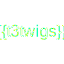

# README


[](https://github.com/digedag/t3twigs)
[](https://packagist.org/packages/digedag/t3twigs)
[](https://github.com/digedag/t3twigs/actions/workflows/php.yaml)
[](https://packagist.org/packages/digedag/t3twigs)


## t3twigs - Use Twig template rendering engine for TYPO3
### What is it for?

Use [Twig](https://twig.symfony.com/) as template enginge for TYPO3 template development instead of fluid or marker templates.


### Installation

Install TYPO3 via composer. From project root you need to run

```bash
composer require "digedag/t3twigs"
```

### Credits

This extensions was forked from [t3twig](https://github.com/DMKEBUSINESSGMBH/typo3-t3twig).

* [Michael Wagner](https://github.com/rengaw83)
* [RocKordier](https://github.com/RocKordier)
* [Markus Bachmann](https://github.com/Baachi)
